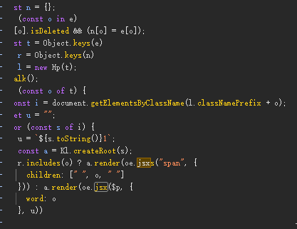
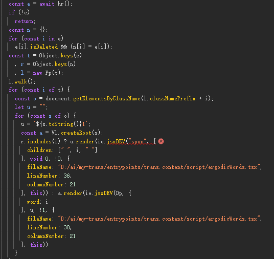

I'm facing a discrepancy between my development and production builds. The production build unexpectedly includes jsxdev syntax, leading to runtime errors. Although using jiti as a transpiler can mitigate this issue, I'd like to explore other approaches to eliminate the need for jiti.

# use entrypointLoader: 'jiti',

# remove entrypointLoader: 'jiti',

